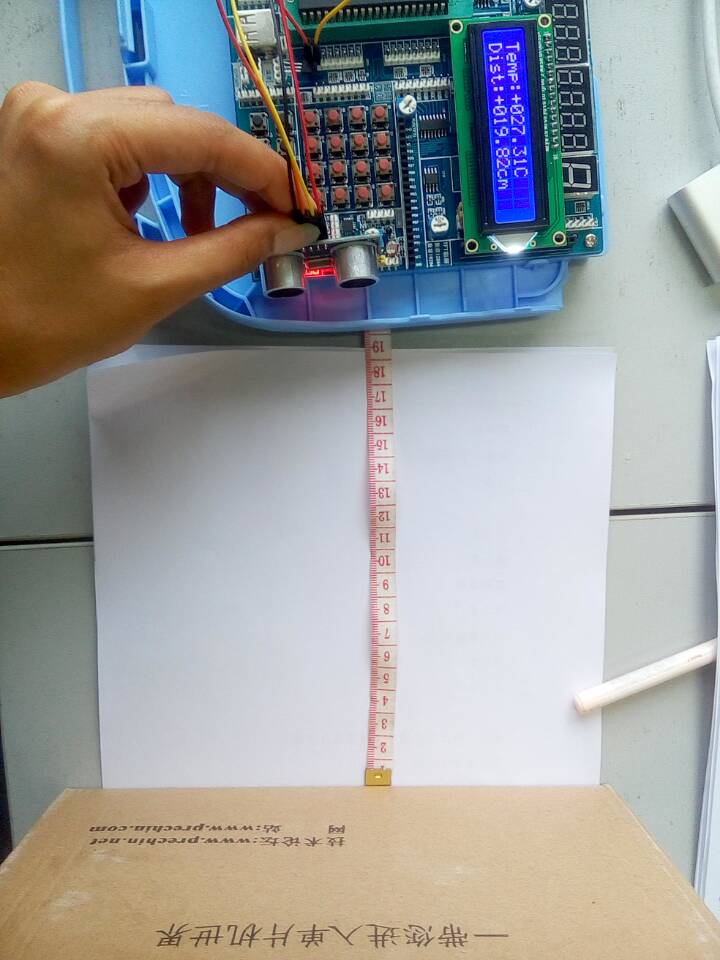
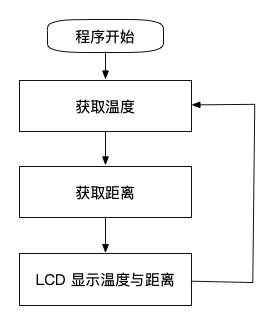
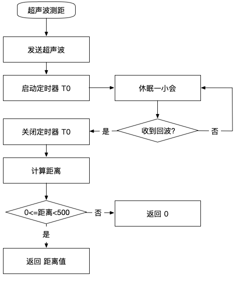
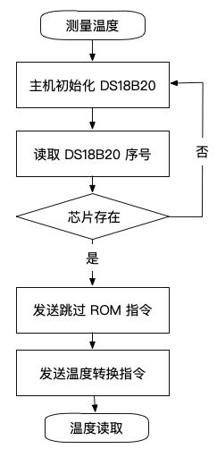
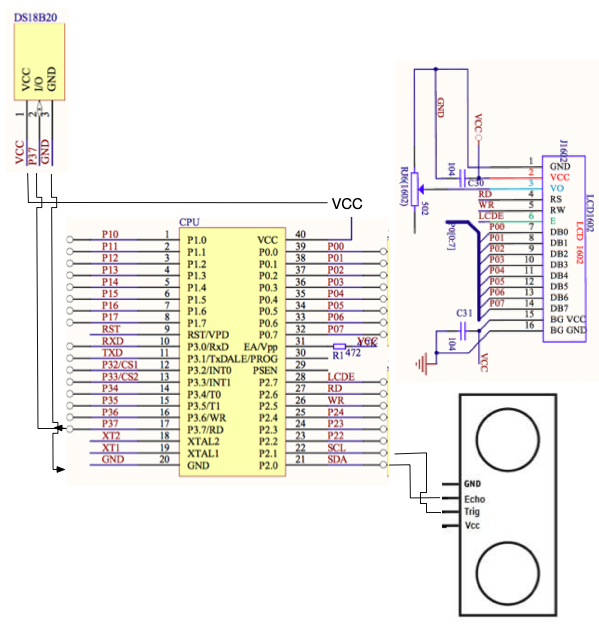
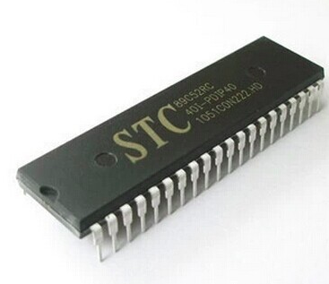
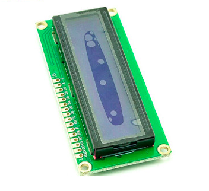
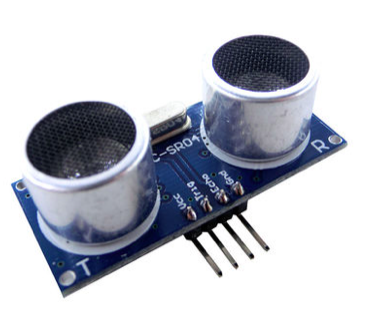
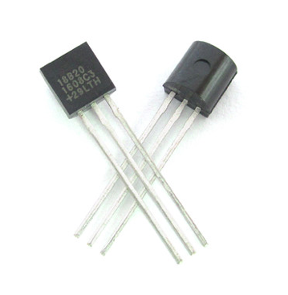

# UltrasonicRanging

STC89C51下基于温度补偿的超声波测距系统, 是我大三上期 "嵌入式开发课" 的课程设计项目. 所有的源码都是自己写的, 经过调优后比网上一些没有利用温度来修正的超声波测距源码要精确许多.

## 文件介绍
文件名称 | 文件作用
------------ | -------------
Sonar.h \ Sonar.c | "HC-SR04超声波模块"
temp.h \ temp.c | "DS18B20温度传感器模块"
LCD1602.h \ LCD1602.c | "LCD1602显示温度与距离"
Main.c | "程序运行逻辑"

## 程序流程
### 主程序流程图

### HC-SR04超声波模块

### DS18B20温度传感器模块

## 硬件介绍
### 硬件连接图

### STC89C51

### LCD1602

### HC-SR04

### DS18B20

