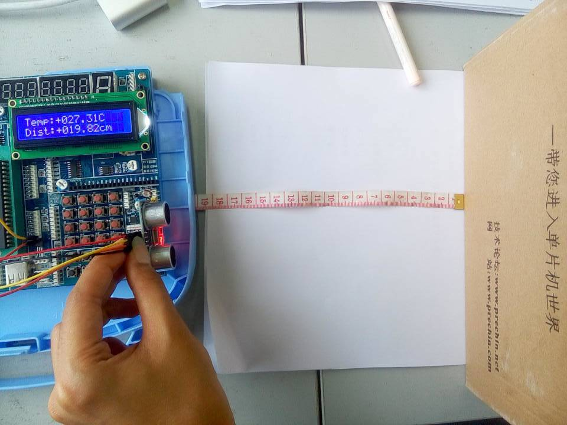

# UltrasonicRanging

STC89C51下利用温度修正的超声波测距系统, 是我大三上期 "嵌入式开发课" 的课程设计项目. 所有的源码都是自己写的, 经过调优后比网上一些没有利用温度来修正的超声波测距源码要精确许多.

## 文件介绍
* LCD1602.h \ LCD1602.c - "LCD1602显示温度与距离"
* Sonar.h \ Sonar.c - "HC-SR04超声波模块"
* temp.h \ temp.c - "DS18B20温度传感器模块"
* Main.c - "程序运行逻辑"

## 硬件介绍
1. STC89C51

1. LCD1602

1. HC-SR04

1. DS18B20
